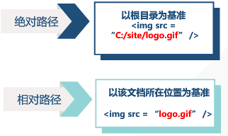

---

title: html
layout: content
category: html
date: 2019-12-26 01:00:15

---


一个基本的html模板


```
<!DOCTYPE html>
<html>
<head>

	<meta charset="UTF-8" />
	<meta name="viewport" content="width=device-width, initial-scale=1.0, maximum-scale=1">
	<meta name="generator" content="Jekyll">
	<title>Document</title>

</head>
<body>


</div>
</body>
</html>

```
### 一、基本概念
1.html(HyperText MarkUp Language)：是超文S本标记语言（超文本：通过超链接形式有机的组织起来；标记：标签）	

2.后缀名：.html / .html

3.不区分大小写

4.html元素语法：    
&nbsp;&nbsp;&nbsp;&nbsp; 整个html以`<html>`开始，以`</html>`结束    
&nbsp;&nbsp;&nbsp;&nbsp; html以开始标签开始，以结束标签终止    
&nbsp;&nbsp;&nbsp;&nbsp; 元素的内容：开始标签与结束标签之间的内容    
&nbsp;&nbsp;&nbsp;&nbsp; 大多数html元素都有属性

### 二、标签
#### 1.标签列举说明
> `<html></html>`
- `<body></body>`
- `<title></title>`

> `<meta>`：表示网页元数据，是提供给浏览器和搜索引擎的关于网页的描述性数据    
> 段落标签：`<p></p>`    

> 文本容器/段内分组`<span></span>`    

> 标题标签`<h1>~<h6>`：一级表题到六级标题【字号由大到小,自动加黑】

> 水平线标签`<hr />`
	* width：宽度
	* size：高度
	* text-align：对齐方式

> 换行标签：`<br />`    

> 空格&nbsp；    

> 预留格式标签:`<pre></pre>` 【文本会按照输入的格式输出】 

> `<a></a>`：跳转页面

&nbsp;&nbsp;&nbsp;&nbsp;跳转当前页面的其他部分，如：

```
<div id="top"></div>
<div id="content">
  <a href="top">头部</a>
</div>
```

&nbsp;&nbsp;&nbsp;&nbsp;跳转其他页面，如：`<a href="xxx.html">xxx</a>`

&nbsp;&nbsp;&nbsp;&nbsp;跳转到外部站点,，如：`<a href="http://www.baidu.com">百度</a>`

&nbsp;&nbsp;&nbsp;&nbsp;虚拟超链接：`<a href="#">内容文字</a>`

> 图象标签：``    
* 图像常见格式：
	&nbsp;&nbsp;&nbsp;&nbsp; JPEG：有损压缩，几乎无颜色限制，处理时可控制压缩比率
	&nbsp;&nbsp;&nbsp;&nbsp; GIF：简单动画、背景透明
	&nbsp;&nbsp;&nbsp;&nbsp; PNG：无损压缩、透明、交错、动画    
* 插入图片:
* img的属性：
	&nbsp;&nbsp;&nbsp;&nbsp; src：路径 &nbsp;&nbsp;&nbsp;&nbsp; 文件名
	&nbsp;&nbsp;&nbsp;&nbsp; alt：图片不显示时，提示
*  路径:
	;
	相对路径：
	&nbsp;&nbsp;&nbsp;&nbsp;  ./ ：同级文件
	&nbsp;&nbsp;&nbsp;&nbsp;  ../ ：上一级文件

> 区块标签`<div></div>`

> 列表标签
* 无序标签`<ul></ul>`：符号开头
* 有序标签`<ol></ol>`：默认数字作为序号开头
* 通常结合`<li></li>`使用

> 表格标签
* `<table></table>`：定义表格    
* `<caption></caption>`：定义表格标题	
* `<th></th>`：表头单元格    	
* `<tr><tr>`：定义行	
* `<td></td>`：定义单元格	
	&nbsp;&nbsp;&nbsp;&nbsp; rowspan：纵向合并单元格	
	&nbsp;&nbsp;&nbsp;&nbsp; colspan：横向合并danyuange
	&nbsp;&nbsp;&nbsp;&nbsp; 公共属性
	&nbsp;&nbsp;&nbsp;&nbsp; align
	&nbsp;&nbsp;&nbsp;&nbsp; bgcolor
	&nbsp;&nbsp;&nbsp;&nbsp; border
	&nbsp;&nbsp;&nbsp;&nbsp; width
	&nbsp;&nbsp;&nbsp;&nbsp; height

> 表单标签
* `<from></from>`：定义一个表单区域，用来采集用户信息
	&nbsp;&nbsp;&nbsp;&nbsp; action属性：数据处理网页
	&nbsp;&nbsp;&nbsp;&nbsp; 表单元素：文本框、按钮、单选、多选【放置于`<from></from>`内】   
* `<input>`：定义输入域
	&nbsp;&nbsp;&nbsp;&nbsp; type属性：
		· text（文本），
		· password（密码），
		· radio(单选，checked默认勾选；注意：同一组的单选框的name属性的值要一致)，
		· checkbox（复选框，checked默认勾选；同一组多选的name属性值要一致），
		· button（普通按钮）
		· submit（提交按钮）
		· reset（重置按钮）
		· image（图片按钮）
			 name属性：为该input标签起名字
			 value属性：按钮中显示的文字/文本框中的内容是什么    /    传给后端的值   
* 文本域：`<textarea></textarea>`
	&nbsp;&nbsp;&nbsp;&nbsp; rows：行数
	&nbsp;&nbsp;&nbsp;&nbsp; cols：列数

> 按钮标签`<button></button>`

> 文字    
* 文字设计标签`<front></front>`
	&nbsp;&nbsp;&nbsp;&nbsp; color：字体颜色
	&nbsp;&nbsp;&nbsp;&nbsp; face：字体样式
	&nbsp;&nbsp;&nbsp;&nbsp; size：字体大小
* 字体加粗标签： `<b>无语义化</b>`、`<strong>语义化了</strong>`
* 斜体标签: `<i>无语义化</i>`、`<em>语义化</em>`
* 删除线`<del></del>`

> 输入标题`<label></label>`

> 下拉选项
* 定义列表`<select></select>`
	&nbsp;&nbsp;&nbsp;&nbsp; 属性multiple：设为可多选
	&nbsp;&nbsp;&nbsp;&nbsp; 属性size：下拉菜单显示的项目数
* 定义列表中的选项`<option></option>`

> 选项组
* 定义`<optgroup></optgroup>`
* 定义选项`<option></option>`

>> 框架标签<frameset></frameset>    
	* 作用：将几个页面作为一个网页的几个部分显示，便于网页的开发与维护。一个框架网页中的每个窗口都是一个完整的HTML网页    
	* `<frameset></frameset>`中不需要写`<body></body>`

>> 属性：    
	* rows：横向分割网页。属性值决定分割页面的大小，如：cols = "30%, 70%"    
	* cols：纵向分割网页。    
	* border：边框

>> 包含的标签`<frame></frame>`    
		&nbsp;&nbsp;&nbsp;&nbsp; 表示框架窗口中的内容，一个`<frame></frame>`表示一个框架窗口，排序从左到右，从上到下    
		&nbsp;&nbsp;&nbsp;&nbsp; src：其属性值是框架内容的url    
		&nbsp;&nbsp;&nbsp;&nbsp; noresize：表示该框架不可被用户改变大小    
		&nbsp;&nbsp;&nbsp;&nbsp; scrolling：表示是否有滚动条   

2.注释
```<!-- 注释内容 -->```    
3.标签分类

> 标签可分为：
&nbsp;&nbsp;&nbsp;&nbsp; 成对标签，如：`<div></div>`
&nbsp;&nbsp;&nbsp;&nbsp; 单个标签，如：``
&nbsp;&nbsp;&nbsp;&nbsp; 块级元素，行内元素和行内块级元素，还有置换元素   

4.标签嵌套

> 标签不断嵌套，形成了HTML DOM树
	• 父元素
	• 子元素
	• 同级元素    

5.web语义化
> 定义：让页面具有良好的结构与含义，从而让人和机器都能快速理解网页内容

> 优点：
&nbsp;&nbsp;&nbsp;&nbsp; 结构清晰，有利于团队的开发、维护<人>
&nbsp;&nbsp;&nbsp;&nbsp; 有利于搜索引擎理解【SEO(Search Engine Optimization)搜索引擎优化】<机器>
&nbsp;&nbsp;&nbsp;&nbsp; 容易兼容不同设备<机器>    

> 常见语义化标签：em、strong、dd、dl、dt

> 例子：自定义列表dl、列表项dt、描述dd

```
<dl>
  <dt>HTML</dt>
  <dd>超文本标记语言</dd>
  <dt>CSS</dt>
  <dd>层叠样式表</dd>
</dl> 
```

### 三、HTML文件结构
1.HTML文件的基本结构
```
<!DOCTYPE html>  <!-- 表明文档类型符合HTML5标准-->
<html lang="en">    <!-- lang属性：搜索引擎。en：英文；zh：中文 -->
  <!-- head标签部分成为网页的头部：包含浏览器、搜索引擎所需信息 -->
  <head>
    <meta charset="utf-8">  <!-- meta：元数据。可放网页搜索关键字。charset属性：字符集编码方式；由浏览器解析：UTF-8是国际编码 -->
    <title>web page</title>
  </head>
  
  <!-- body主体：网页中包含的具体内容 -->
    <body>
   
    </body>
</html>

```

2.字符集与编码
> utf-8
&nbsp;&nbsp;&nbsp;&nbsp; gbk
&nbsp;&nbsp;&nbsp;&nbsp; unicode
&nbsp;&nbsp;&nbsp;&nbsp; gb2312

3.乱码问题：
> 源文件保存时的编码
- 源文件声明`<meta charset="编码方式">`    
当上面两者不一致时，就会出现乱码问题

4.HTML编辑器 
> 记事本
&nbsp;&nbsp;&nbsp;&nbsp; Sublime Text3 —— emmet插件【最常用的】
&nbsp;&nbsp;&nbsp;&nbsp; vs code【也挺火】
&nbsp;&nbsp;&nbsp;&nbsp; WebStorm【涉及工程会用到】
&nbsp;&nbsp;&nbsp;&nbsp; HBuilder【一款由我国开发的前端开发IDE】
&nbsp;&nbsp;&nbsp;&nbsp; ......

### 四、居中
1.容器居中    
&nbsp;&nbsp;&nbsp;&nbsp;提前：父级容器有宽高   
&nbsp;&nbsp;&nbsp;&nbsp;• 左右居中
	margin：0 auto;

2.内容居中左右    
	&nbsp;&nbsp;&nbsp;&nbsp;text-align:center;

3.文字上下居中    
	&nbsp;&nbsp;&nbsp;&nbsp;提前：设置容器的高度。如：height: 20px;    
	&nbsp;&nbsp;&nbsp;&nbsp;适用于：单行文字的，多行的的话不可    
	&nbsp;&nbsp;&nbsp;&nbsp;line-height: 20px;

### 五、习题
1. 
2. 
3. 
4.解析：
HTML的结构包括头部(Head)、主体(Body)两大部分，其中头部描述浏览器所需的信息，而主体则包含所要说明的具体内容。
其实这句话没有绝对的正确和绝对的错误的说法，因为按照现在的W3C制定的HTML 4.01标准，HTML文档是制必须包括头部知和主体两大部分的。
但是如果你写的网页不包含头部，网页一般还是运行显示出来